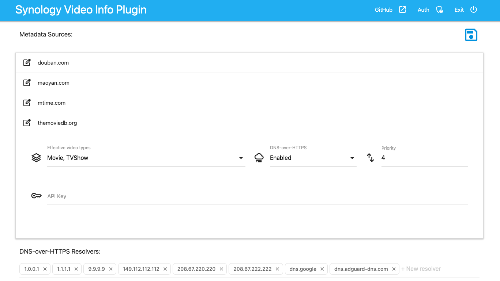

# *Syno*logy Video Info Plugin

[](https://github.com/C5H12O5/syno-videoinfo-plugin/releases)


[](LICENSE)

###### 📖 [English](README.md) / 📖 简体中文

本项目是群晖 **Video Station** 的第三方视频信息插件，它提供了一种从各大影视数据库平台获取视频元数据的方法。

* 使用Python标准库实现，无需安装任何依赖。
* 支持多个数据来源，并且可以轻松扩展。
* 有简单的配置页面，可以自定义你的插件。



## 使用说明

安装插件：

1. 从[***此处***](https://github.com/C5H12O5/syno-videoinfo-plugin/releases)下载最新版本。
2. 打开 **Video Station**，进入 ***设置*** > ***视频信息插件***。
3. 点击 **[新增]**，选择第一步下载的压缩包，然后点击 **[确定]**。

配置插件：

1. 打开你的浏览器，输入`http://[NAS_IP]:5125`（将`[NAS_IP]`替换为你的NAS的IP地址）打开配置页面。
2. 根据你的需要修改配置，然后点击右上角的 **[ :floppy_disk: ]** 按钮。
3. 返回你的 **Video Station**，保存的配置将会自动生效。
* **[注意 :warning: ]** 如果升级了插件但是配置页面没有更新，可以通过以下步骤来重启配置服务：
  1. 打开配置页面，点击右上角的 **[Exit]** 按钮关闭配置服务。
  2. 返回 **Video Station**，进入 ***设置*** > ***视频信息插件***，点击 **[测试连接]** 按钮即可重新启动配置服务。

## 版本要求

* Python 3.6+
* DSM 7.0+
* Video Station 3.0.0+

## 参考文献

* [视频元数据](https://kb.synology.cn/zh-cn/DSM/help/VideoStation/metadata?version=7)
* [Video Station API 文档](https://download.synology.com/download/Document/Software/DeveloperGuide/Package/VideoStation/All/enu/Synology_Video_Station_API_enu.pdf)

> 视频文件命名提示：
>
> 电影：
>
> * 命名格式：电影名称 (发行年份).ext
> * 例如：Avatar (2009).avi
>
> 电视节目：
> * 命名格式：电视节目名称.SXX.EYY.ext（***S*** 是 ***季数*** 的缩写，***E*** 是 ***集数*** 的缩写）
> * 例如：Gossip Girl.S03.E04.avi

## 如何开发

您可以基于本项目并按以下步骤来开发自己的插件：

1. 将本项目克隆到本地：

```shell
git clone https://github.com/C5H12O5/syno-videoinfo-plugin
```

2. 根据需要修改代码，并可以使用以下命令进行测试：

```shell
python main.py --type movie --input "{\"title\":\"{movie_title}\"}" --limit 1 --loglevel debug
```

3. 然后可以使用以下命令进行打包并上传使用：

```shell
python setup.py sdist --formats=zip
```

## 使用许可

[Apache-2.0 license](LICENSE)